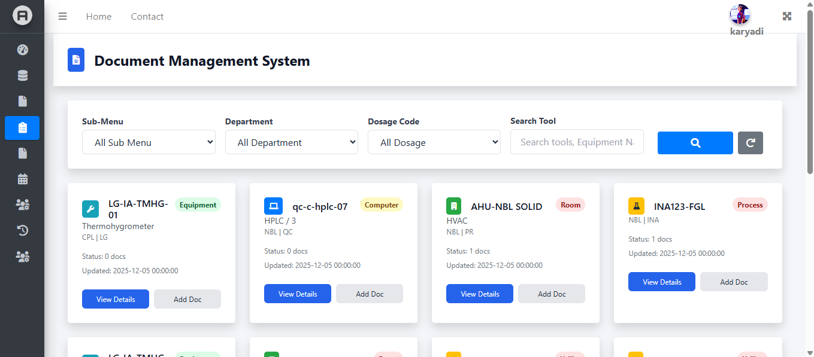
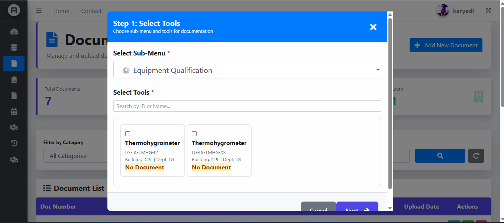
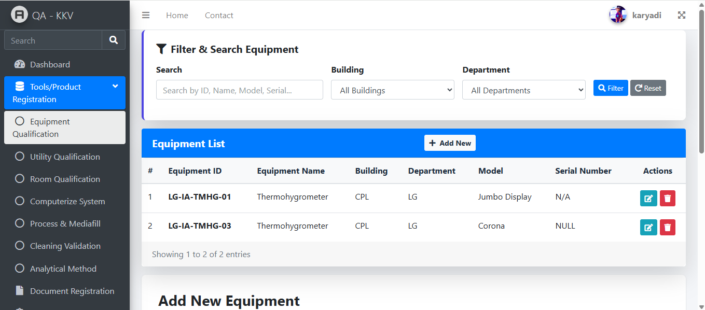
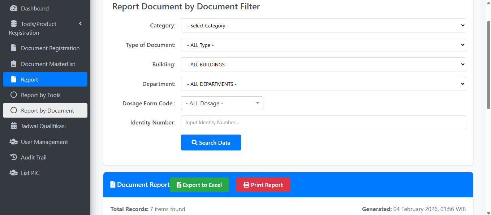
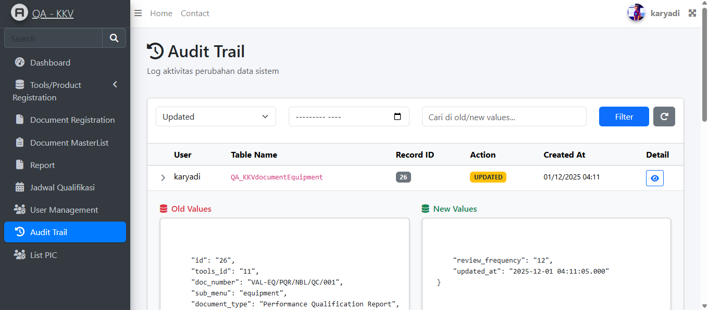

# Document Management System (DMS)

## Deskripsi

Document Management System (DMS) adalah aplikasi internal untuk mengelola dokumen perusahaan secara terpusat, aman, dan terstruktur. Sistem ini mendukung proses **upload dokumen, approval bertahap, revisi dokumen, audit trail**, serta monitoring status dokumen melalui dashboard.

Aplikasi ini dirancang untuk kebutuhan internal perusahaan dan dapat dikembangkan lebih lanjut sesuai kebutuhan bisnis.

---

## Fitur Utama

* Manajemen dokumen (upload, download, versioning)
* Approval dokumen bertahap (multi-level approval)
* Status dokumen (Draft, Submitted, Approved, Rejected, Revised)
* Revisi dokumen dengan riwayat yang tercatat
* Audit trail (siapa, kapan, dan apa yang dilakukan)
* Dashboard ringkasan dokumen
* Hak akses berbasis role (Admin, Uploader, Approver)

---

## Teknologi yang Digunakan

### Backend

* **PHP** >= 7.x
* **Laravel Framework 5.4**

### Frontend

* **Blade Template Engine**
* **Bootstrap 4**
* **Material Dashboard BS4 (Creative Tim)**
* HTML5, CSS3, JavaScript

### Web Server

* **Nginx**

### Database

* **Relational Database**

  * MySQL / MariaDB *(default)*
  * PostgreSQL *(opsional / dapat dikonfigurasi)*

### Lainnya

* Composer
* Git (Version Control)

---

## Struktur Database (Gambaran Umum)

### Tabel Utama

* `users`
* `roles`
* `documents`
* `document_versions`
* `document_approvals`
* `approval_logs`
* `audit_trails`

### Contoh Relasi

* Satu dokumen dapat memiliki banyak versi
* Satu dokumen memiliki beberapa approver
* Setiap aksi dicatat pada tabel audit trail

---

## Alur Sistem

1. User melakukan upload dokumen
2. Dokumen berstatus **Draft / Submitted**
3. Approver level 1 melakukan approval
4. Jika disetujui → lanjut ke approver berikutnya
5. Jika ditolak → dokumen kembali ke uploader untuk revisi
6. Setelah semua approver menyetujui → status **Approved**

---

## Dashboard

Dashboard menampilkan ringkasan data seperti:

* Total dokumen
* Dokumen menunggu approval
* Dokumen approved
* Dokumen rejected
* Statistik dokumen per kategori

---

## Screenshot Aplikasi

> **Catatan:** Screenshot di bawah ini merupakan tampilan dari aplikasi yang telah dibuat.

### 1. Login Page


### 2. Dashboard



### 3. Upload Dokumen



### 4. Register Tools / Product



### 5. Report with fileter



### 6. Audit Trail



---

## Instalasi

1. Clone repository

```bash
git clone <repository-url>
```

2. Install dependency

```bash
composer install
```

3. Copy file environment

```bash
cp .env.example .env
```

4. Konfigurasi database di file `.env`

5. Generate application key

```bash
php artisan key:generate
```

6. Jalankan migration

```bash
php artisan migrate
```

7. Jalankan aplikasi

```bash
php artisan serve
```

---

## Konfigurasi Nginx (Ringkas)

* Root mengarah ke folder `public`
* Pastikan permission folder `storage` dan `bootstrap/cache`

---

## Pengembangan Selanjutnya

* Notifikasi email approval
* Digital signature
* Export laporan (PDF / Excel)
* Integrasi SSO
* Log aktivitas lebih detail

---

## Author

**Document Management System Team**

---

## Lisensi

Project ini digunakan untuk kebutuhan internal perusahaan
